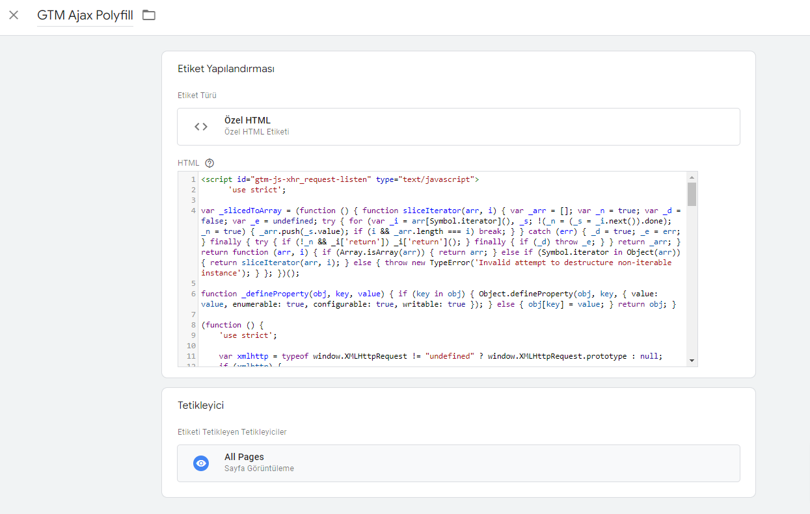
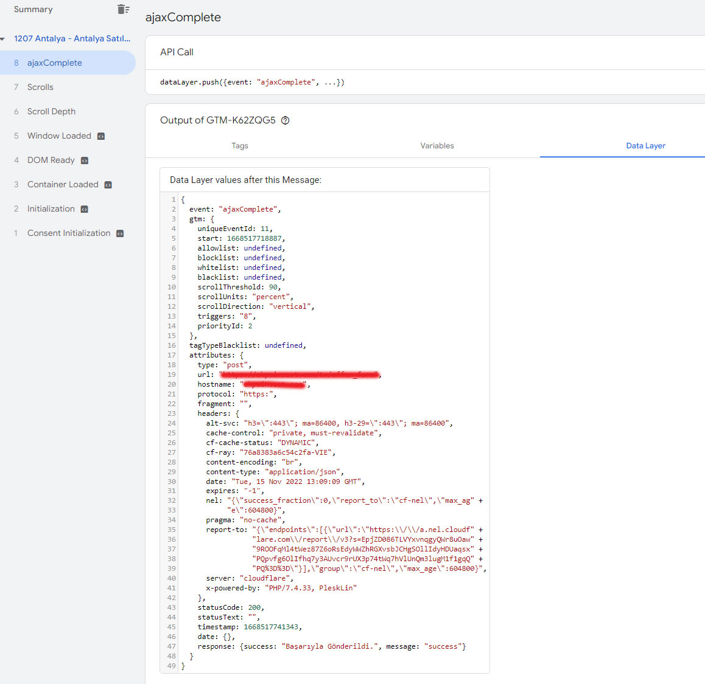
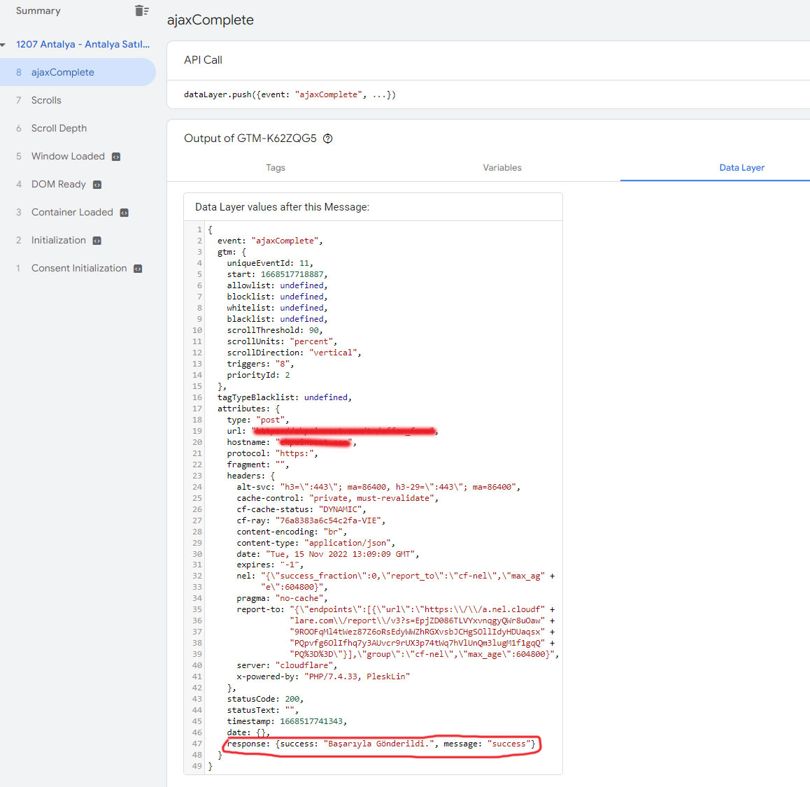
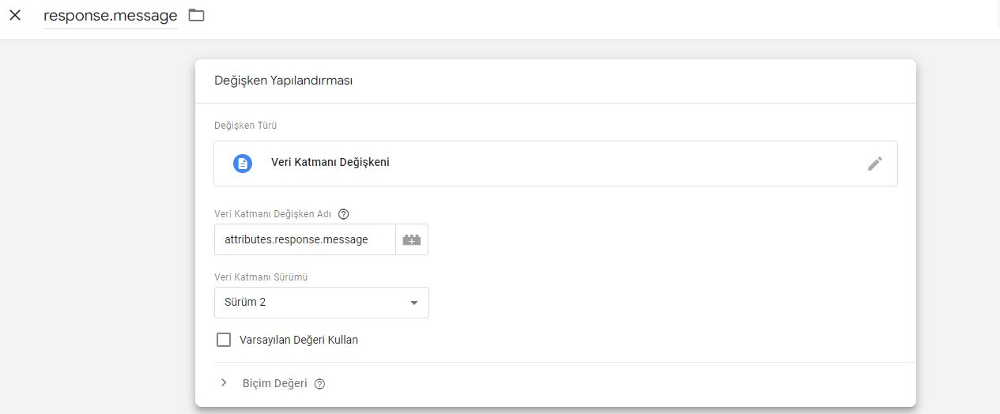
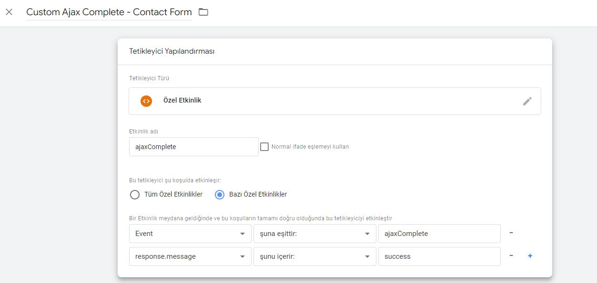

# Google Tag Manager - AjaxPolyfill
 ## Custom HTML tag with the Javascript XHR Request listener
 
Your form is probably not supported by the built-in Form Submission trigger and is not redirecting users to a "thank you" page. It will likely refresh itself and then display the message "You successfully filled out the form" without any actual page refresh.

## Install
- Copy the code from the <b>src/ajax_polyfill_render.js</b> file and paste it into the Custom HTML tag in Google Tag Manager:
- Set that Custom HTML tag to fire on all pages.

&nbsp;

&nbsp;

Now, let’s check whether a form is built on AJAX:
Click ajaxComplete event in Preview and Debug mode, then expand the API call:

Looks difficult for a non-developer, right? But it’s easier than you think.

This is data was passed to the data layer after successful submission of the form. Each line is a separate dataLayer data point that can be used as a dataLayer variable in GTM.

Now you should look for something that helps identify successful form submission. Scroll down and look for “response”.

&nbsp;

Let's take a closer look. 
<b>response.message</b>
Bingo! We can use this as a trigger.

## Data Layer Variable and Custom Event Trigger
First, let’s create a Data Layer variable in Google Tag Manager.

- Go to Variables
- Scroll down to User-Defined  variable and hit New
- Click Variable configuration and choose variable type – Data Layer Variable
- Enter Data Layer Variable Name – response.message

&nbsp;

<b>IMPORTANT:</b> in your case, the structure of the data can be different and parameters can be named differently. It will always start with attributes.response but after that, things might differ in every form. It might be attributes.response.message or something like that. You will need to adapt.
  
Now let’s create a trigger that fires when the event is ajaxComplete AND our new Data Layer variable contains “success”.

- Go to Triggers and click New
- Choose Trigger Type – Custom Event
- Enter Event name – ajaxComplete
- This trigger should fire on Some Custom Events.
- Define a condition when the trigger will fire – dlv – attributes.response.message contains success!

If Google Tag Manager AJAX Form Tracking Is Not Working For You, feel free to contact me.

[ufuxio@gmail.com](mailto:ufuxio@gmail.com)
